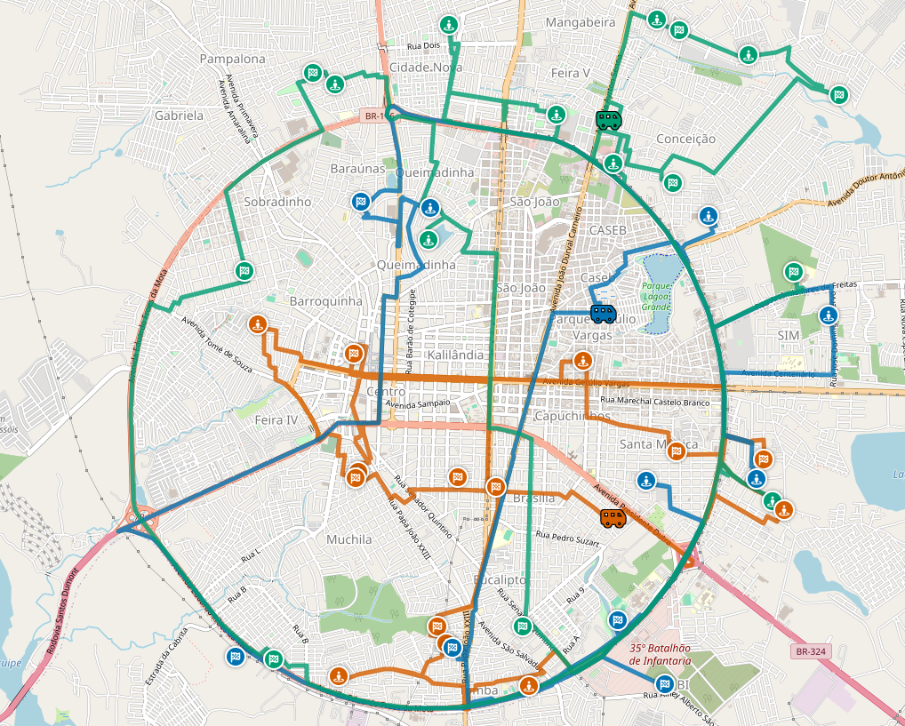

# 🚐 VRP-PD Enterprise: Intelligent Passenger Routing

**TL;DR:** An optimization engine built with Java/Quarkus that solves the Vehicle Routing Problem with Pickup and Delivery (VRP-PD) using metaheuristic search.


*(Visual example of the engine optimizing multiple vans simultaneously on the urban grid)*

## What is VRP-PD?

Vehicle Routing Problem with Pickup and Delivery (VRP-PD) is a classical NP-Hard optimization problem where vehicles must transport passengers between pickup and delivery locations while respecting constraints such as capacity, time windows, and maximum ride time.

## 🎯 The Business Problem (Use Case)
On-demand shared transport systems — such as **municipal patient transport, school vans, or adapted fleets (wheelchair accessible)** — face the challenge of maximizing vehicle occupancy without subjecting passengers to endless journeys.

This system replaces human guesswork with rigorous mathematical optimization, ensuring:
1. **Comfort SLA:** No passenger spends more than 90 minutes inside the vehicle.
2. **Independent Time Windows:** Passengers are picked up at their scheduled time and delivered in time for their appointments.
3. **Full Fleet Utilization:** Automatic penalization for idle vehicles, evenly distributing the workload across the available fleet.

## 🧠 Engineering Highlights (Seniority)

This is not a standard CRUD application. The project handles asynchronous processing and optimization algorithms within an NP-Hard search space.

* **Continuous Capacity Planning:** Utilizes `@ShadowVariable` from **Timefold** to track the exact fluctuation of free seats at every pickup (+1) and delivery (-1) along the route.
* **GIS Integration with O(1) Cache:** Ahead-of-time (parallel) calculation of the Distance Matrix using **GraphHopper**, avoiding network bottlenecks during the AI search phase.
* **Resilience and Circuit Breaker:** Shielded HTTP client. If the map engine container crashes, the system trips the circuit breaker and triggers an instant *Fallback* to calculate distances via the Haversine formula (straight line), ensuring the API never experiences downtime in production.

## 🚀 Quick Start (Running in your environment)

Whether in your local environment (Arch Linux, macOS, Windows) or on a production server, the application is 100% containerized.

**1. Clone and enter the directory:**
```bash
git clone https://github.com/Dhekki/PACE.git
cd PACE
```

**2. Start the Geographic Engine (GraphHopper) via Docker:**
*(Ensure you have the city's `.pbf` map file inside the `/data` folder)*
```bash
docker run -d \
    --name graphhopper \
    -v $(pwd)/data/feira.pbf:/graphhopper/data/feira.pbf \
    -p 8989:8989 \
    israelhikingmap/graphhopper \
    --input /graphhopper/data/feira.pbf
```

**3. Start the Optimized Backend:**
```bash
# For development with Live Reload:
mvn quarkus:dev

# OR to run the final production image (Java 21 LTS):
docker build -t vehicle-routing-api .
docker run -d --name vrp-api --network host vehicle-routing-api
```

**4. Test the Magic:**
Go to `http://localhost:8080`, click on "Data" to load the demo dataset, and hit the **Solve** button.

## Observations

### Local GraphHopper Engine

Instead of relying on the public GraphHopper API, this project runs a
local GraphHopper instance using OpenStreetMap data.

This avoids:
- strict API rate limits
- per-request pricing
- network latency during solver execution

All distances are computed locally from OSM data, allowing the solver
to scale to hundreds of locations without external dependencies.
